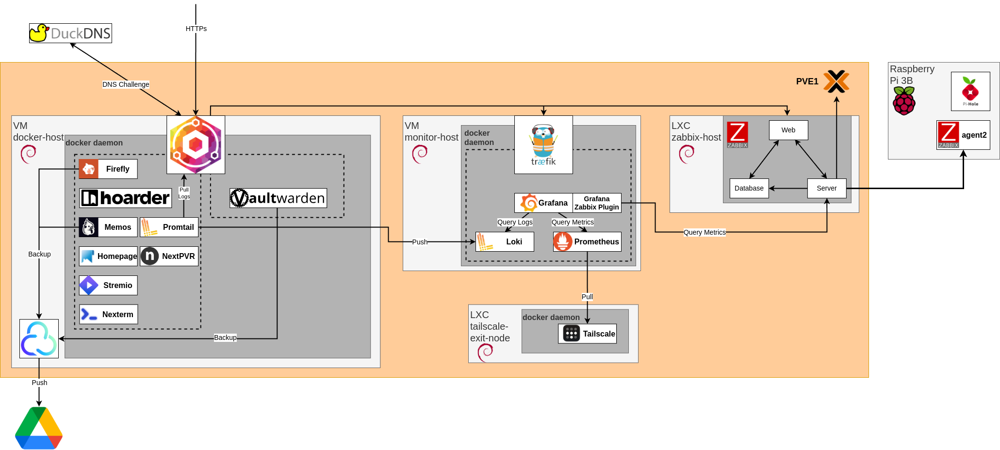

# Homelab Documentation

This repository serves as the main reference for my homelab setup, which consists of two primary devices:

- **GMKTEC M5 PLUS**: Running **Proxmox** as the hypervisor.
  - **Proxmox Stability Fix**: To prevent random reboots on Proxmox instances using AMD processors, update the GRUB configuration by replacing the existing line **GRUB_CMDLINE_LINUX_DEFAULT** in `/etc/default/grub` with the following:

    ```sh
    GRUB_CMDLINE_LINUX_DEFAULT="quiet pci=assign-busses apicmaintimer idle=poll reboot=cold,hard"
    ```

    Then, apply the changes and reboot:

    ```sh
    update-grub
    reboot
    ```

    More details can be found in this discussion: [Proxmox Mystery Random Reboots](https://forum.proxmox.com/threads/proxmox-mystery-random-reboots.125001/)

- **Raspberry Pi 3B**: Running **Pi-hole** as my local DNS server.

## Homelab Overview
My homelab is structured into different stacks, each hosted on different virtual machines (VMs) or Linux Containers (LXC) to ensure modularity and ease of management.

### **Service Stack**
The service part of the network, hosted in the docker-host VM, is composed of the **service-stack**, which runs various self-hosted applications. This stack also includes **Nginx Proxy Manager (NPM)** to provide HTTPS access via DuckDNS and cloud backups for some services.

### **Monitor Stack**
The monitor part of the network consists of the **monitor-stack**, hosted in the monitor-host VM, and an **LXC container running Zabbix** for monitoring metrics. Other monitoring tools, such as **Grafana, Prometheus, Loki**, are also part of this stack.

### **Networking & Remote Access**
The network includes a **Tailscale Exit Node** running in an LXC container for secure remote access and **Pi-hole** on the Raspberry Pi 3B for local DNS resolution and ad blocking.

## Infrastructure Diagram
Below is a visual representation of my homelab setup:


---

This documentation will be updated as my homelab evolves. 🚀
